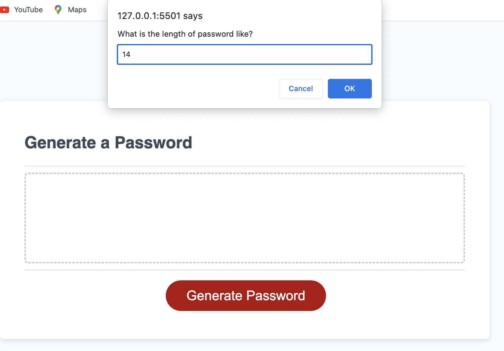
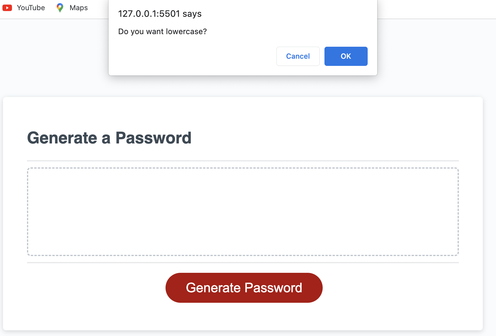
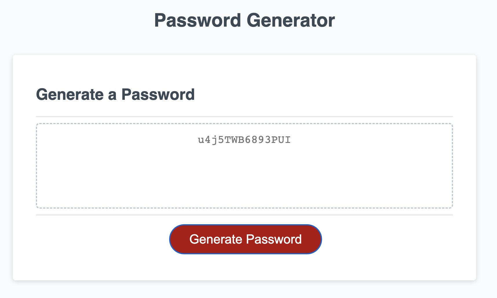

# Password Generator JavaScript 

## Description

A password generator is a web tool that creates unique and random passwords based on security recommendations. It create strong, randdom, and secure passwords to keep you safe online.

## Mock-Up

The following image shows the web application's appearance and functionality:

## Instruction

* Generate a password when the button is clicked
  * Present a series of prompts for password criteria
    * Length of password
      * At least 8 characters but no more than 128.
    * Character types
      * Lowercase
      * Uppercase
      * Numeric
      * Special characters ($@%&*, etc)
  * Code should validate for each input and at least one character type should be selected
  * Once prompts are answered then the password should be generated and displayed in an alert or written to the page

## Technologies Uses 

  - HTML
  - CSS
  - JavaScript

## Deployed Site
[gitHub deployed site](https://noeamelya.github.io/pass_generator/)

## OUTCOME :

## Useful Links 
[Window: prompt() Method](https://developer.mozilla.org/en-US/docs/Web/API/Window/prompt)

[Math.floor()Method](https://developer.mozilla.org/en-US/docs/Web/JavaScript/Reference/Global_Objects/Math/floor)

[Math.random()Method](https://developer.mozilla.org/en-US/docs/Web/JavaScript/Reference/Global_Objects/Math/random)

[The parseInt() function parses a string argument](https://developer.mozilla.org/en-US/docs/Web/JavaScript/Reference/Global_Objects/parseInt)

[Javascript user input password generator](https://stackoverflow.com/questions/61239900/javascript-user-input-password-generator)

## License
MIT @N Amelya

## CONTACT 

noeamelyaofficial@hotmail.com

Copyright (c) 2023 N Amelya
